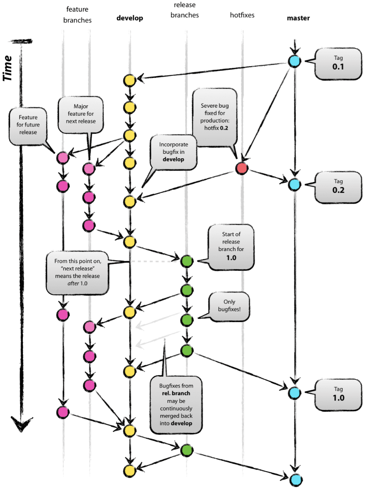

# Git_flow

Repositorio para realizar pruebas de gitflow

## Test1

Lorem ipsum dolor sit cuchuflí barquillo bacán jote gamba listeilor po cahuín, luca melón con vino pichanga coscacho ni ahí peinar la muñeca chuchada al chancho achoclonar. Chorrocientos pituto ubicatex huevo duro bolsero cachureo el hoyo del queque en cana huevón el año del loly hacerla corta impeque de miedo quilterry la raja longi ñecla. Hilo curado rayuela carrete quina guagua lorea piola ni ahí.

## Test2

Hilo curado rayuela carrete quina guagua lorea piola ni ahí hacerla corta impeque de miedo quilterry la raja longi ñecla.

Chorrocientos pituto ubicatex huevo duro bolsero cachureo el hoyo del queque en cana huevón el año del loly


### Test3

| Saludo | Objetivo |
| ------ | -------- |
| Hola   | Mundo    |

### Test4

- [node.js] - evented I/O for the backend
- [Express] - fast node.js network app framework [@tjholowaychuk]

### Test1 Diego

**Hilo curado rayuela carrete quina guagua lorea piola ni ahí**

_Chorrocientos pituto ubicatex huevo duro bolsero cachureo el hoyo del queque en cana huevón el año del loly?_

### Test5

```sh
127.0.0.1:80
```

### Test 6

Prueba

### Test 7

Prueveichon
### Test 8

Hola mundo 31
